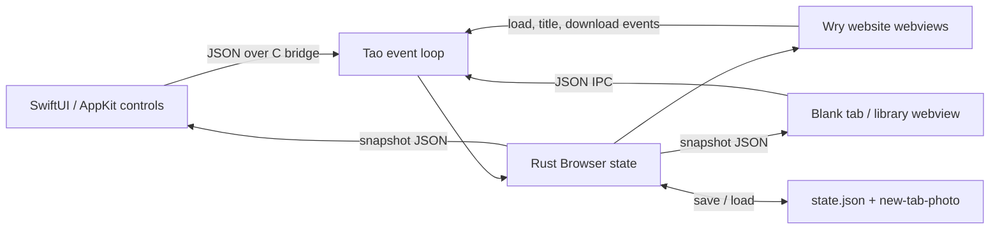

# How Moth works

Moth separates the browser controls from website rendering. SwiftUI draws the sidebar, toolbar, ⌘T command bar, and photo control as native views. Wry creates one WebKit webview for each website tab. A small additional webview displays the blank-tab photo and bookmarks/history/downloads panels. Rust owns the browser state and decides which webview is visible.

## Startup

1. `src/main.rs` calls `app::run()`. Tao creates the event loop, window, and macOS keyboard menu in `src/app.rs`.
2. `Browser::new()` creates the shell webview, loads `BrowserData`, and installs the native Swift interface through `src/native_chrome.rs`.
3. Saved tabs are restored into their workspaces. If none exist in the active workspace, Moth creates a blank tab.
4. `Browser::refresh()` sends a JSON snapshot to both the Swift interface and the shell page.

`build.rs` compiles `native/Chrome.swift` into a static library. The Rust bridge calls its exported C functions. In the opposite direction, Swift serializes `Command` values as JSON and passes them to Rust's event loop proxy. This keeps `Browser` as the single place where state changes happen.

## ⌘T and navigation

The native menu sends `NewTab` to `Browser::handle_command()`, which asks Swift to show the command bar. The input receives keyboard focus without creating a tab. Submitting text sends `OpenNewTab { value }`; Rust resolves it as a URL or search query in `src/address.rs` and creates a new website webview. Submitting an empty input sends `OpenBlankTab`. Escape closes the overlay without changing the tab list. ⌘K opens the same native overlay in tab-switching mode.

The toolbar address field uses `Navigate { value }` to load a URL in the current tab. Page-load and title callbacks send `BrowserEvent` messages back into Tao. The event loop updates the tab, records history, and refreshes the interface. Websites do not receive Moth's command bridge.

## Blank tab and photo

The blank-tab page is just a full-size image element over an otherwise empty surface. SwiftUI places a small native photo control at its bottom right. Its AppKit file picker sends the chosen path to Rust. Rust checks the size and image signature, copies it to `new-tab-photo` beside `state.json`, and increments `photo_version` in the UI snapshot. The shell reloads the image through its local `moth-photo://` protocol. That version also updates the image when the user chooses a replacement. The photo remains available after restart; removing it deletes the saved copy.

The shell positions the image against the full window dimensions, even though its webview begins below the toolbar and beside the sidebar. SwiftUI draws the same image behind those native views and places macOS materials over it. This keeps the photo visually continuous while preserving native controls and their glass edges. The photo control opens horizontal and vertical crop sliders; `SetPhotoPosition` saves their percentages in `state.json`, and both renderers use them to align the image.

The shell HTML, CSS, and JavaScript are embedded into the executable with `include_str!`, so editing `ui/shell.*` requires a rebuild.

## State, layout, and limits

On macOS, the default data directory is `~/Library/Application Support/Moth/`. `state.json` stores bookmarks, a bounded history, workspaces, and session tab URLs. The image is stored as `new-tab-photo`. Writes use a temporary file and rename. `MOTH_DATA_DIR` can override the base directory for local testing.

`Browser::resize()` gives the native sidebar 252 logical pixels and the native toolbar 68 logical pixels. The remaining area shows the active website webview, or the shell webview when a blank tab or library panel is active. Switching tabs changes visibility without recreating website webviews.

Workspaces organize tabs; they are not separate browsing profiles or cookie containers. Reopening a closed tab restores its URL, not its back/forward history. Moth currently has no Chrome/Firefox extension support, private browsing, tracker blocker, or full permission settings. Site compatibility follows the installed macOS WebKit version.

## Suggested reading path

1. Follow ⌘T from `src/app.rs::setup_menu()` to `Browser::handle_command()`, then into `native/Chrome.swift::CommandPalette`.
2. Follow a submitted URL through `Command::OpenNewTab`, `resolve_address()`, and `Browser::new_tab_in_workspace()`.
3. Follow a photo selection from `ChromeModel::choosePhoto()` through `Browser::set_new_tab_photo()` to `ui/shell.js::renderState`.
4. Follow a page-load event into history and `BrowserData::save()`.
